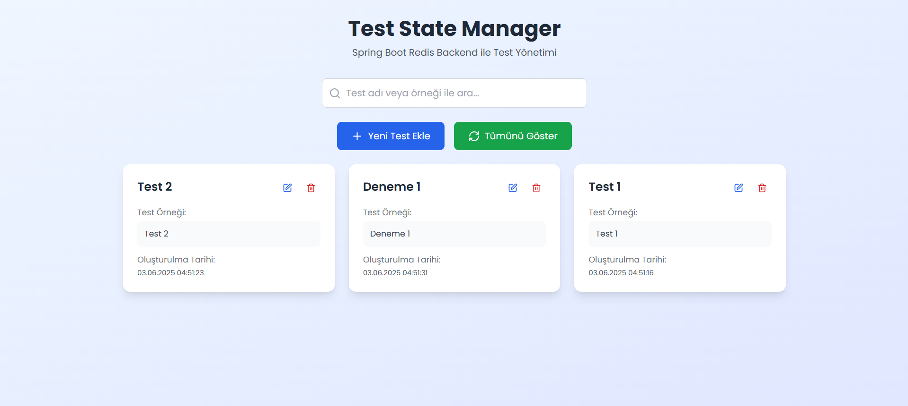

## 👛 `Redis Example App`

<br>

<div align="center">

</div>

<br>

- ✅ Basic Redis Example App

<br>

<details>
<summary>🐳 Docker</summary>

</details>

<details>
<summary>🌐 Open API</summary>

</details>

<details>
<summary>📊 Redis Insight</summary>

</details>

<br>

Used Technologies in The Project:

[](https://react.dev/)
[](https://www.java.com/en/)
[](https://spring.io/)
[](https://maven.apache.org/)
[](https://redis.io/)
[](https://redis.io/insight/)
[](https://www.java.com/en/)

<br>

### Installation

```bash
git clone https://github.com/furkankayam/redis-example-app.git
```

<br>

### Usage

```bash
docker-compose up
```

<br>

### URL

##### Frontend App

```bash
http://localhost
```

##### Redis Insight

```bash
http://localhost:5540
```

##### Open API

```bash
http://localhost:8080/api/swagger-ui.html
```

<br>

### Redis Insight Connection Details

- Host: `redis`
- Port: `6379`
- Username: `redis`
- Password: `s3cret`

<br>

<br>

# License

This project is licensed under the MIT License. See the [LICENSE](LICENSE) file for details

Created by [Mehmet Furkan KAYA](https://www.linkedin.com/in/mehmet-furkan-kaya/)
